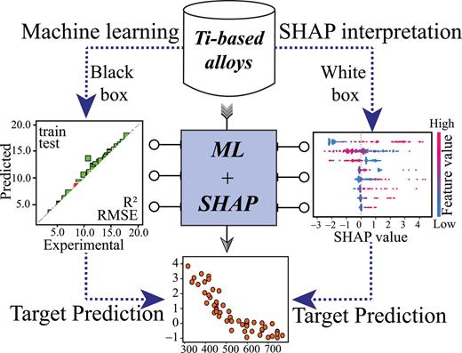

## データセット

    
本研究では、177種類のチタン合金を対象としたクリープデータセット "creep_data.xlsx" を用います。このデータセットは、各合金の組成、クリープ試験条件、熱処理情報を網羅的に収録しており、以下の特徴を有します。

合金組成: 各合金の具体的な元素組成（含有量など）が記録されています。  
クリープ試験条件: クリープ試験時の温度、応力などのパラメータが詳細に記録されています。  
熱処理情報: 合金の製造過程における熱処理条件（温度、時間など）が記録されています。

本研究の目的は、これらのマテリアル情報と実験条件を説明変数とし、**クリープ寿命（Rupture time）**を目的変数とする予測モデルを構築することです。具体的には、機械学習などの手法を用いて、合金の組成、クリープ試験条件、熱処理情報からクリープ寿命を高精度に予測できるモデルを開発することを目指します。

[1] S. Sucheta, R. Ashish and S. A. Kumar, "Machine learning assisted interpretation of creep and fatigue life in titanium alloys", *APL Machine Learning*, **1**, 016102 (2023)

  

 
  

 
---

## 特徴量

**Chemical composition** 
1. Titanium (wt %) Ti 
1. Alumunium (wt %) Al 
1. Vanadium (wt %) Vn 
1. Carbon (wt %) C 
1. Nitrogen (wt %) N 
1. Oxygen (wt %) O 
1. Hydrogen (wt %) H 
1. Iron (wt %) Fe 0 
1. Silicon (wt %) Si 
1. Tin (wt %) Sn 
1. Niobium (wt %) Nb 
1. Molybednum (wt %) Mo 
1. Zirconium (wt %) Zr 
1. Boron (wt %) B 
1. Chromium (wt %) Cr 

**Experimental parameters**
1. Rupture strain (%) ϵr 
1. Temperature of measurement (cel) Tcreep 
1. Steady state strain rate (1/s) ˙ ϵ 
1. Applied stress (MPa) σ 

**Heat treatment conditions**  
1. Aging temperature (cel) Tage 
1. Aging time (hrs) tage 
1. Solution temperature (cel) Tsol
1. Solution time (cel) tsol